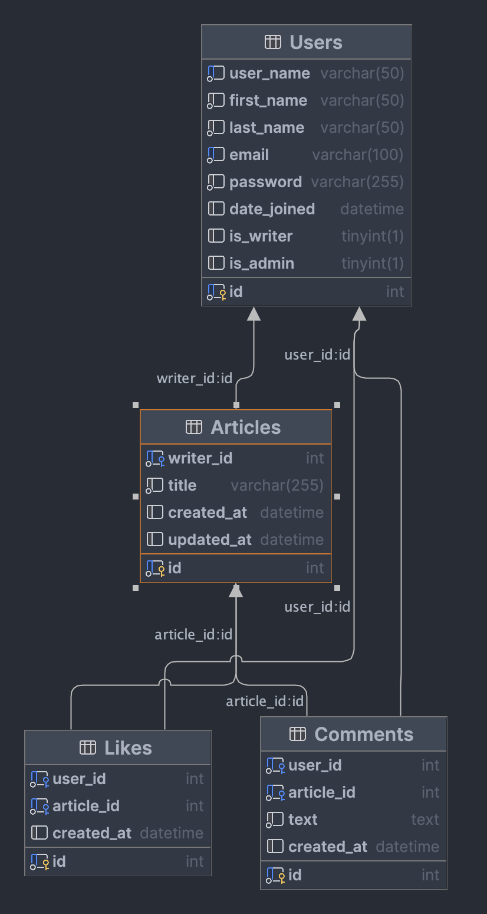

# Full Stack Web Development : Final Project

## Backend

### Database MySQL

#### DSD

This is the DSD diagram for the `MySQL` database



To use the `MySQL` db you need to add a `.env` file with the following content:

```env
DB_HOST=HOST_NAME
DB_USER=USER_NAME
DB_PASS=PASSWORD
DB_NAME=DATABASE_NAME
```

### Database MongoDB

This is the Schema for the `MongoDB` database

```json
"Articles": [
    {
        "_id": "ObjectId",
        "db_id": "String",
        "title": "String",
        "content": "String",
        "writer_id": "String",
        "tags": "Array",
        "date": "Date",
    }
]
```

To use the `MongoDB` db you need to add a `.env` file with the following content:

```env
MONGO_URI=URI
```